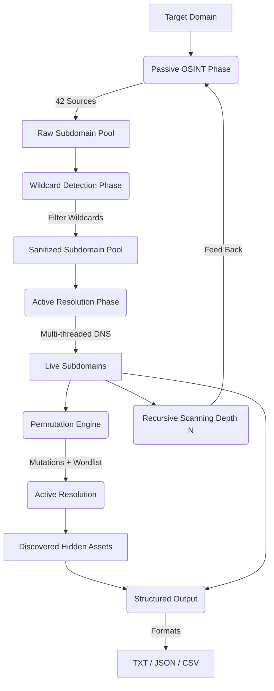

# 🔱 SUBIX

[](https://goreportcard.com/report/github.com/youwannahackme/subix)
[](https://opensource.org/licenses/MIT)
[](https://github.com/youwannahackme/subix)
[](https://github.com/youwannahackme/subix/pulls)

**Subix** is a god-level, blazing-fast, hybrid subdomain enumeration engine written in Go. It combines the power of **42 passive OSINT sources** with advanced active capabilities—multi-threaded DNS resolution, smart wildcard filtering, recursive enumeration, and a permutation engine—into a single high-performance tool.

Unlike other tools that require complex chaining of multiple CLI utilities, Subix handles the entire passive-to-active discovery pipeline in one unified run.

---

## 🗺️ Engine Architecture & Pipeline

Subix operates using a structured pipeline that ensures maximum coverage while maintaining zero false positives:



---

## 🌟 Key Features

### 1. 42 Passive OSINT Sources
Scrapes and queries certificate transparency logs, web archives, search engines, and threat intelligence APIs. It includes built-in rate-limiting and connection retry logic with exponential backoff.

### 2. Built-in Active Resolver
High-concurrency DNS resolution to verify which subdomains are alive. Built using Go's native net resolver for maximum throughput.

### 3. Smart Wildcard Filtering
Prevents false positives by dynamically detecting wildcard DNS records. It attempts to resolve randomized subdomains (e.g., `l8d2j1s9.target.com`) and automatically filters out IPs that resolve to wildcard landing pages.

### 4. Recursive Enumeration
Feeds newly discovered live subdomains back into the passive discovery pipeline recursively up to a user-defined depth.

### 5. Permutation Engine
Generates mutations of discovered subdomains using an internal or custom wordlist (e.g., adding `dev`, `stage`, `api`, `v1`) and resolves them actively.

---

## 🛠️ Installation

You can install Subix directly using Go:

```bash
go install -v github.com/youwannahackme/subix@latest
```

Ensure your Go bin directory (usually `$HOME/go/bin` or `%USERPROFILE%\go\bin`) is in your system's `PATH`.

---

## ⚙️ Configuration

Subix works out of the box using free, keyless sources. To unlock the full potential of all 42 sources, configure your API keys in the provider configuration file.

1. Create a config file at `~/.config/subix/provider-config.yaml`.
2. Add your API keys. You can use the template located in [configs/provider-config.yaml](configs/provider-config.yaml):

```yaml
# ~/.config/subix/provider-config.yaml
sources:
  certtransparency:
    crtsh: true
    censys: true
  api:
    virustotal: true
    shodan: true
    zoomeye: true
    fofa: true
    netlas: true
    alienvault: true

apikeys:
  virustotal: "YOUR_VIRUSTOTAL_KEY"
  shodan: "YOUR_SHODAN_KEY"
  zoomeye: "YOUR_ZOOMEYE_KEY"
  fofa: "YOUR_FOFA_KEY"
  netlas: "YOUR_NETLAS_KEY"
  alienvault: "YOUR_ALIENVAULT_OTX_KEY"
```

Use the `--config` flag to specify a custom path to your config file:
```bash
subix -d example.com --config ./my-config.yaml
```

---

## 🚀 Advanced Usage Examples

### 1. Basic Passive Scan
Enumerate subdomains using all enabled free/passive sources:
```bash
subix -d example.com
```

### 2. Active Verification (DNS Resolution)
Resolve all discovered subdomains via DNS and only output the ones that are alive:
```bash
subix -d example.com -resolve -only-resolved
```

### 3. All-in-One Full Recon Pipeline
Run passive enumeration, filter wildcards, perform recursive subdomain scanning (depth 2), generate and resolve permutations, and save the output to a JSON file:
```bash
subix -d example.com -resolve -wildcard -recursive -depth 2 -permute -o results.json -j
```

### 4. High-Performance Multi-Domain Scan
Scan a list of domains from a file with high concurrency (50 threads) and output in CSV:
```bash
subix -l domains.txt -threads 50 -o active_subs.csv -c
```

---

## 🔱 Available Sources (42)

| Category | Sources |
| :--- | :--- |
| **Certificate Transparency** | `crtsh`, `censys` (API), `certspotter` |
| **DNS & Services** | `dnsdumpster`, `hackertarget`, `urlscan`, `alienvault`, `anubis`, `subdomaincenter`, `threatcrowd`, `columbus`, `jldc`, `sonar`, `robtex`, `rapiddns`, `synapsint`, `riddler` |
| **Web Archives** | `wayback`, `commoncrawl` |
| **Search Engines** | `bing`, `duckduckgo`, `google`, `yahoo`, `baidu`, `yandex`, `ask` |
| **Premium APIs (Keys)** | `securitytrails`, `virustotal`, `shodan`, `passivetotal`, `chaos`, `bevigil`, `zoomeye`, `fofa`, `hunter`, `intelx`, `leakix`, `netlas`, `binaryedge`, `threatbook`, `quake`, `c99` |

To list all available sources in your terminal:
```bash
subix --list-sources
```

---

## 💻 Developer Guide: Adding a New Source

Adding a new passive source to Subix is simple. Every source must implement the `Source` interface defined in `pkg/types/types.go`:

```go
type Source interface {
	Name() string
	Run(domain string, session *Session) ([]string, error)
}
```

### Example Implementation

Create a new file under `internal/sources/services/myservice.go`:

```go
package services

import (
	"encoding/json"
	"fmt"
	"io"
	"net/http"
	"github.com/youwannahackme/subix/pkg/types"
)

type MyService struct{}

func (m *MyService) Name() string {
	return "myservice"
}

func (m *MyService) Run(domain string, session *types.Session) ([]string, error) {
	url := fmt.Sprintf("https://api.myservice.com/subdomains?domain=%s", domain)
	req, err := http.NewRequest("GET", url, nil)
	if err != nil {
		return nil, err
	}
	req.Header.Set("User-Agent", types.DefaultUserAgent)

	resp, err := session.DoWithRetry(req)
	if err != nil {
		return nil, err
	}
	defer resp.Body.Close()

	body, err := io.ReadAll(resp.Body)
	if err != nil {
		return nil, err
	}

	var results []string
	if err := json.Unmarshal(body, &results); err != nil {
		return nil, err
	}

	return results, nil
}
```

Then register your new source in `internal/sources/source.go` inside the `AllSources()` function.

---

## 📄 License

This project is licensed under the MIT License - see the [LICENSE](LICENSE) file for details.
